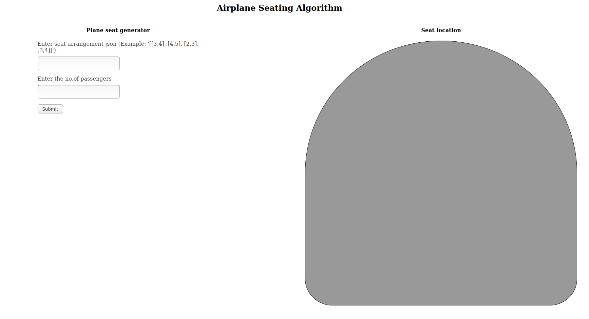
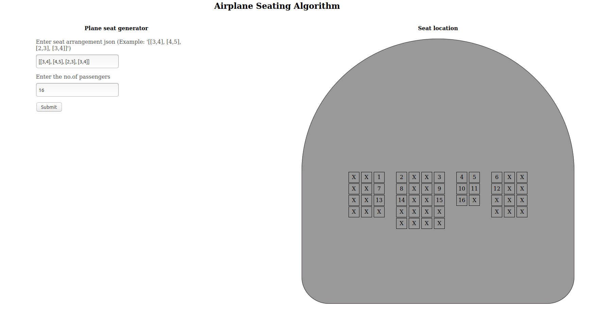

# plane_seating

Airplane seating algorithm

## ruby version = 2.5,3

## Rails version = 6.1.0

### Run

- install rvm latest
- create particular gemset
- bundle install
- start rails server (rails s)

#### output images

## run rspec

- rspec spec